<a name="readme-top"></a>

[![Contributors][contributors-shield]][contributors-url]
[![Forks][forks-shield]][forks-url]
[![Stargazers][stars-shield]][stars-url]
[![Issues][issues-shield]][issues-url]
[![MIT License][license-shield]][license-url]
[![LinkedIn][linkedin-shield]][linkedin-url]

<!-- PROJECT LOGO -->
<br />
<div align="center">
  <a href="https://github.com/Aboudoc/Uniswap-V3-Arbitrage.git">
    
  </a>

<h3 align="center">Arbitrage Profit for Constant Product AMM</h3>

  <p align="center">
    Uniswap V3
    <br />
    <a href="https://github.com/Aboudoc/Uniswap-V3-Arbitrage"><strong>Explore the docs »</strong></a>
    <br />
    <br />
    <a href="https://github.com/Aboudoc/Uniswap-V3-Arbitrage">View Demo</a>
    ·
    <a href="https://github.com/Aboudoc/Uniswap-V3-Arbitrage/issues">Report Bug</a>
    ·
    <a href="https://github.com/Aboudoc/Uniswap-V3-Arbitrage/issues">Request Feature</a>
  </p>
</div>

<!-- TABLE OF CONTENTS -->
<details>
  <summary>Table of Contents</summary>
  <ol>
    <li>
      <a href="#about-the-project">About The Project</a>
      <ul>
        <li><a href="#built-with">Built With</a></li>
      </ul>
    </li>
    <li>
      <a href="#getting-started">Getting Started</a>
      <ul>
        <li><a href="#prerequisites">Prerequisites</a></li>
        <li><a href="#installation">Installation</a></li>
      </ul>
    </li>
    <li><a href="#usage">Usage</a></li>
    <li><a href="#Simple-Arbitrage-Contract">Simple Arbitrage Contract</a></li>
    <li><a href="#Arbitrage-Profit-For-CPAMM">Arbitrage Profit For CPAMM</a></li>
    <li><a href="#Test-Mint-new-position">Test Mint new position</a></li>
    <li><a href="#Forking-mainnet">Forking mainnet</a></li>
    <li><a href="#Note">Note</a></li>
    <li><a href="#roadmap">Roadmap</a></li>
    <li><a href="#contributing">Contributing</a></li>
    <li><a href="#license">License</a></li>
    <li><a href="#contact">Contact</a></li>
    <li><a href="#acknowledgments">Acknowledgments</a></li>
  </ol>
</details>

<!-- ABOUT THE PROJECT Uniswap V3 - Liquidity of a single position -->

## About The Project

Arbitrage between USDC/ETH 0.3% fee pool and USDC/ETH 0.05% fee pool

<p align="right">(<a href="#readme-top">back to top</a>)</p>

### Built With

- [![Hardhat][Hardhat]][Hardhat-url]
- [![Ethers][Ethers.js]][Ethers-url]

<p align="right">(<a href="#readme-top">back to top</a>)</p>

<!-- GETTING STARTED -->

## Getting Started

To get a local copy up and running follow these simple example steps.

### Prerequisites

- npm

  ```sh
  npm init
  ```

- hardhat

  ```sh
  npm install --save-dev hardhat
  ```

  run:

  ```sh
  npx hardhat
  ```

  verify:

  ```sh
  npx hardhat verify --network goerli "contract address" "pair address"
  ```

### Installation

1. Clone the repo

   ```sh
   git clone https://github.com/Aboudoc/Uniswap-V3-Arbitrage.git
   ```

2. Install NPM packages

   ```sh
   npm install
   ```

3. Dependencies

   ```sh
   npm add @uniswap/v3-periphery @uniswap/v3-core
   npm add --save-dev dotenv
   ```

<p align="right">(<a href="#readme-top">back to top</a>)</p>

<!-- USAGE EXAMPLES -->

## Usage

If you need testnet funds, use the [Alchemy testnet faucet](https://goerlifaucet.com/).

**This project shows a simple arbitrage strategy**

You can find a deep overview of Uniswap v3 in [this repo](https://github.com/Aboudoc/Uniswap-v3)

<p align="right">(<a href="#readme-top">back to top</a>)</p>

## Simple Arbitrage Contract

<div>
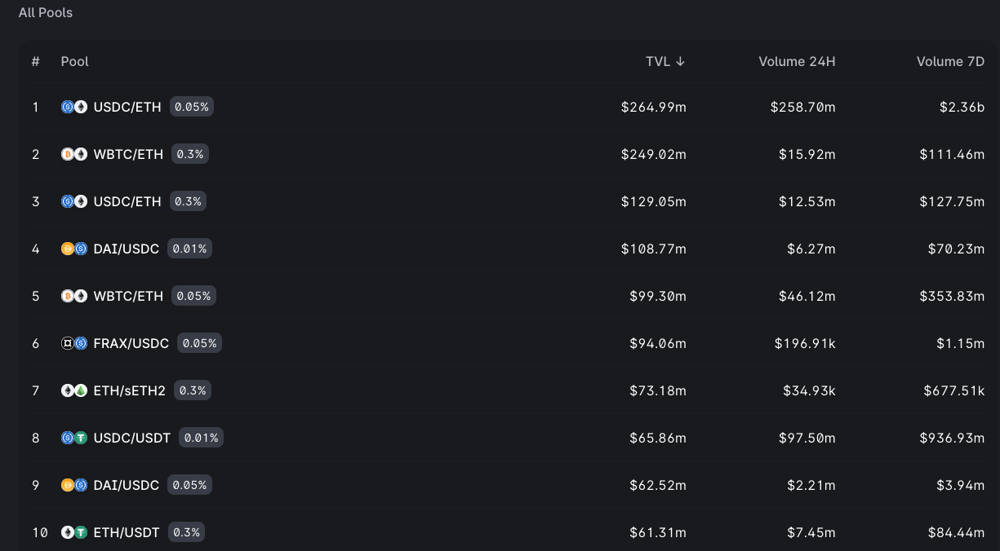
</div>

In this arbitrage example we will:

Borrow `USDC` from one pool
Swap `USDC` back to `WETH` in another pool
Repay first pool with `WETH`
If the amount of WETH bought back in step 2 is greater than the amount repaid in step 3, then there is profit from the the arbitrage. Otherwise there was a loss.

### Function flashSwap

This function will start the arbitrage by borrowing USDC from `pool0`. `pool0` will send USDC to this contract and then call `uniswapV3SwapCallback`

Inside uniswapV3Callback, we will need to send wethAmountIn amount of WETH to pool0.

1. Encode `data` to be later decoded inside `uniswapV3SwapCallback`. The data to encode are `msg.sender`, `pool0` and `fee1`.
2. Initiate the arbitrage by calling `IUniswapV3Pool.swap` on `pool0`. Below are the inputs to pass.

   **_`recipient`:_** Address to receive output token

   **_`zeroForOne`:_** Direction of the swap, true for token0 to token1

   **_`amountSpecified`:_** Amount to swap

   **_`sqrtPriceLimitX96`:_** Limit for the change in price

   **_`data`:_** Data to be passed to `uniswapV3SwapCallback`

### Function \_flash

Swap `tokenIn` for `tokenOut` by calling `router.exactInputSingle`

1. Approve `amountIn`
2. Prepare `params`
3. Call `exactInputSingle` on `router` and store `amountOut`

This function returns `amountOut`

### Function uniswapV3SwapCallback

This function is called by `pool0` immediately after we call `IUniswapV3Pool.swap`.

`amount0` is amount of USDC we borrowed. This variable will be a negative number since USDC is taken out of the pool.

`amount1` is amount of WETH we owe to `pool0`.

`data` is the data we've encoded inside the function `flashSwap`.

1. Decode `data`
2. `msg.sender`must be `pool0`
3. Store `amount0` and `amount1` as `usdcAmountOut` and `wethAmountIn`
4. Call `_swap` to swap USDC for WETH and store `wethAmountOut`
5. Repay WETH back to `pool0`. If there is profit, transfer to `caller`. Otherwise transfer the loss from `caller`.

<p align="right">(<a href="#readme-top">back to top</a>)</p>

## Arbitrage Profit For CPAMM

let's see some equations related to the arbitrage profit for a constant product AMM

<div>
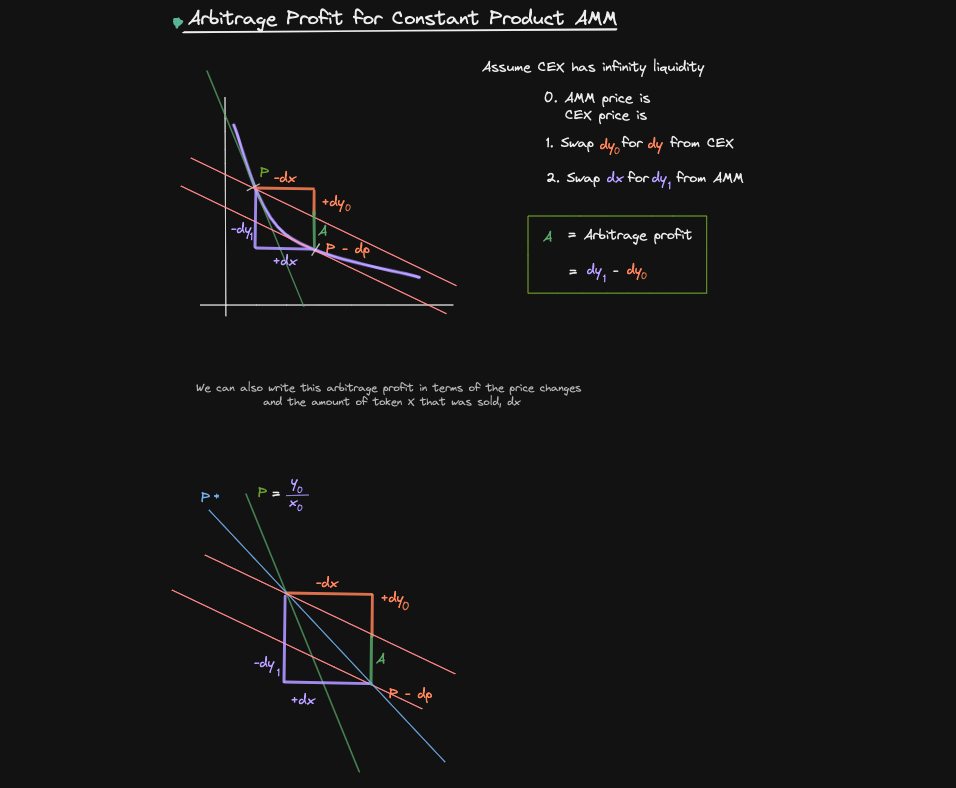
</div>

First, assume that a CEX has infinite liquidity

The AMM has token `X` and token `Y`, and the price `P = Y / X`

On the CEX the price is lower, `p - dp`

An arbitrageur can make a profit: The difference in the token Y that he sold on the CEX and then got back from the AMM is the profit `A`

<div>
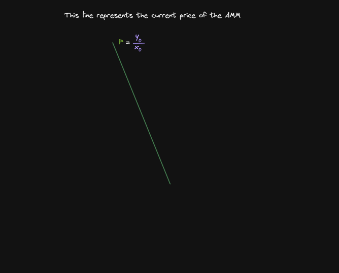
</div>

The green line represents the current price of the AMM. There are X0 amount of token X and Y0 amount of token Y => P = Y0 / X0

<div>
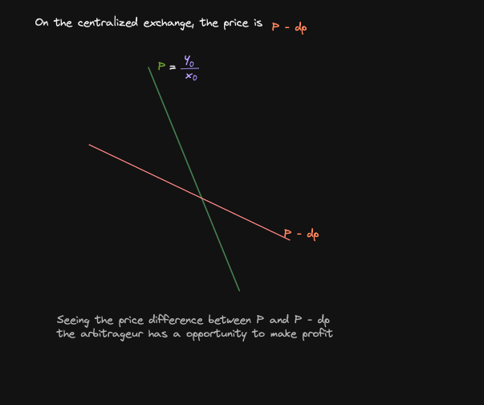
</div>

On the CEX (red line), the price is quoted as `P - dp`

<div>
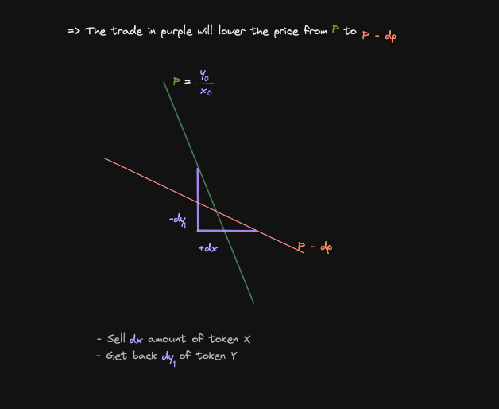
</div>

The trade in purple will lower the price for `P` to `P - dp`. But before the arbitrageur can execute this trade, he first has to get `dx` amount of token `X`.

<div>
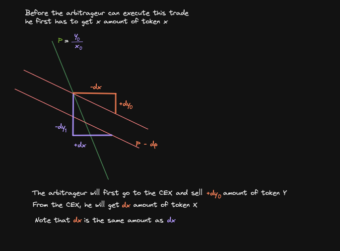
</div>

To do that, the arbitrageur will go to the CEX and then sell `dy0` amount of token `Y` to get `dx` amount of token `X`. Next he will go to AMM and sell this exact amount of token `X` to get back in return `dy1` amount of token `Y`.

**=> On the AMM the price has shifted from P to P - dp.**

<div>
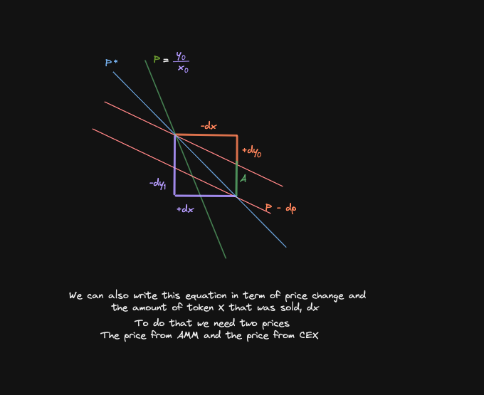
</div>

We can also write this equation in terms of price change and the amount of token `X` that was sold (dx).

To do that we'll need to get two prices, the price of the CEX and the price of the AMM

Take the difference, multiply it by dx and this is the arbitrage profit

Let's start with the `AMM price`

<div>
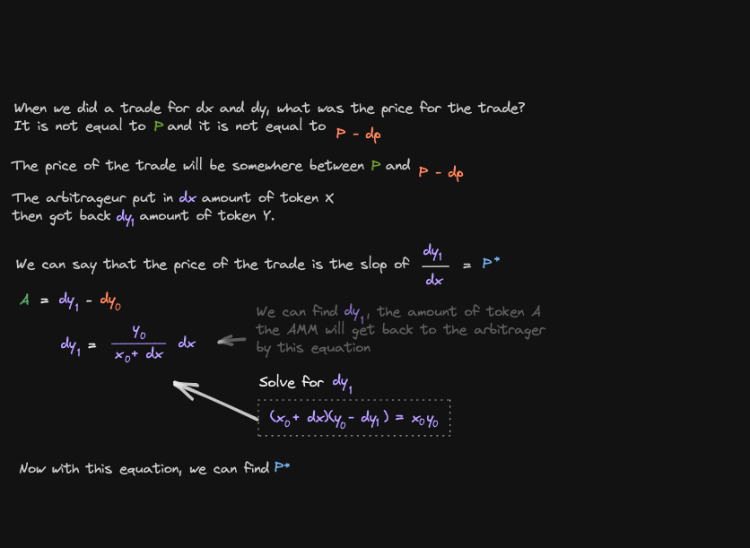
</div>

Let's find the blue slope:

<div>
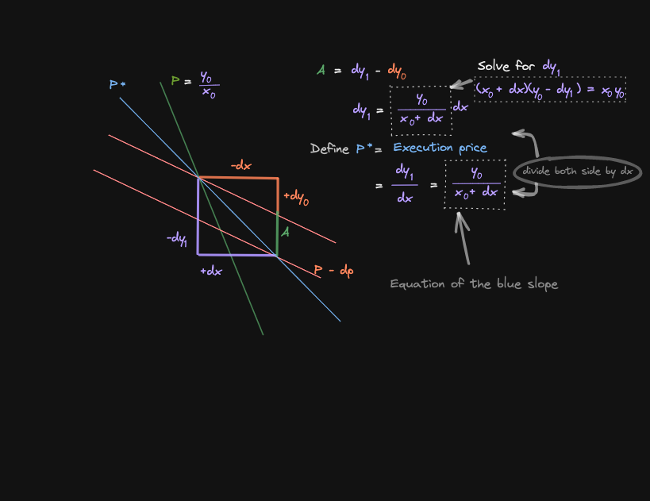
</div>

Let's also rewrite dy0 in terms of price and dx

<div>
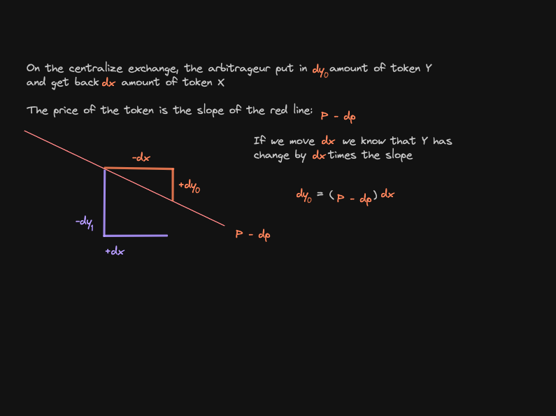
</div>

We are now ready to rewrite the arbitrage profit

<div>
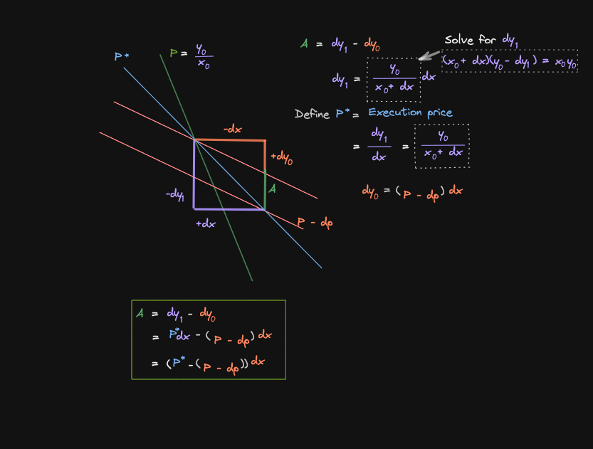
</div>

In some cases, we can further sumplify this equation:

<div>
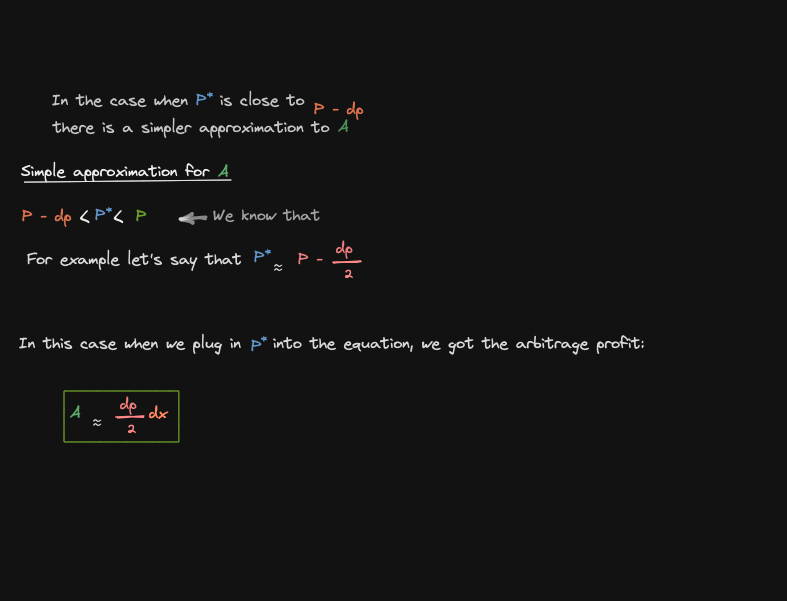
</div>

**Finally:**

<div>
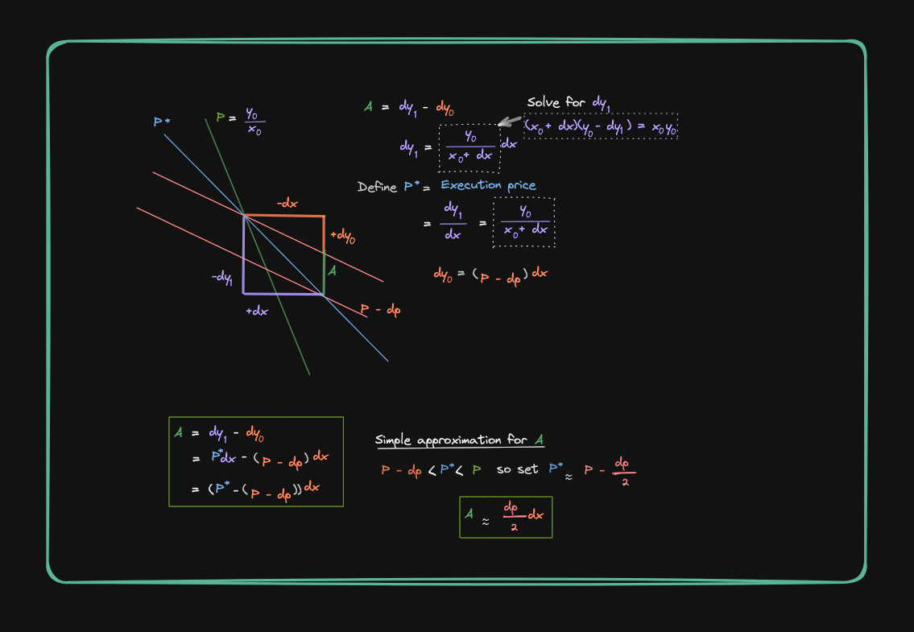
</div>

<p align="right">(<a href="#readme-top">back to top</a>)</p>

## Test Arbitrage (soon...)

<div>

</div>

<p align="right">(<a href="#readme-top">back to top</a>)</p>

## Forking mainnet

`hardhat.config.js`

```sh
  networks: {
        hardhat: {
          forking: {
            url: `https://eth-mainnet.alchemyapi.io/v2/${process.env.ALCHEMY_API_KEY}`,
       },
     },
  }
```

Note: Replace the `${}` component of the URL with your personal [Alchemy](https://www.alchemy.com/) API key.

```sh
npx hardhat test test/swapV3.test.js
```

<p align="right">(<a href="#readme-top">back to top</a>)</p>

## Note

### Further reading

You can find Uniswap pools referenced below. Select a pool with the highest TVL

[Uniswap V3 Pool Infos](https://info.uniswap.org/#/pools)

You can find official Uniswap documentation below:

[Single Hop Swap](https://docs.uniswap.org/contracts/v3/guides/swaps/single-swaps)

[Multi Hop Swap](https://docs.uniswap.org/contracts/v3/guides/swaps/multihop-swaps)

### Sources

[Smart Contract Engineer](https://www.smartcontract.engineer/)

<p align="right">(<a href="#readme-top">back to top</a>)</p>

<!-- ROADMAP -->

## Roadmap

- [-] Maths
- [ ] Test on mainnet fork
- [ ] Deploy on mainnet?
- [ ] Further reading

See the [open issues](https://github.com/Aboudoc/Uniswap-V3-Arbitrage.git/issues) for a full list of proposed features (and known issues).

<p align="right">(<a href="#readme-top">back to top</a>)</p>

<!-- CONTRIBUTING -->

## Contributing

Contributions are what make the open source community such an amazing place to learn, inspire, and create. Any contributions you make are **greatly appreciated**.

If you have a suggestion that would make this better, please fork the repo and create a pull request. You can also simply open an issue with the tag "enhancement".
Don't forget to give the project a star! Thanks again!

1. Fork the Project
2. Create your Feature Branch (`git checkout -b feature/AmazingFeature`)
3. Commit your Changes (`git commit -m 'Add some AmazingFeature'`)
4. Push to the Branch (`git push origin feature/AmazingFeature`)
5. Open a Pull Request

<p align="right">(<a href="#readme-top">back to top</a>)</p>

<!-- LICENSE -->

## License

Distributed under the MIT License. See `LICENSE.txt` for more information.

<p align="right">(<a href="#readme-top">back to top</a>)</p>

<!-- CONTACT -->

## Contact

Reda Aboutika - [@twitter](https://twitter.com/AboutikaR) - reda.aboutika@gmail.com

Project Link: [https://github.com/Aboudoc/Uniswap-V3-Arbitrage.git](https://github.com/Aboudoc/Uniswap-V3-Arbitrage.git)

<p align="right">(<a href="#readme-top">back to top</a>)</p>

<!-- ACKNOWLEDGMENTS -->

## Acknowledgments

- [Smart Contract Engineer](https://www.smartcontract.engineer/)

<p align="right">(<a href="#readme-top">back to top</a>)</p>

<!-- MARKDOWN LINKS & IMAGES -->
<!-- https://www.markdownguide.org/basic-syntax/#reference-style-links -->

[contributors-shield]: https://img.shields.io/github/contributors/Aboudoc/Uniswap-V3-Arbitrage.svg?style=for-the-badge
[contributors-url]: https://github.com/Aboudoc/Uniswap-V3-Arbitrage/graphs/contributors
[forks-shield]: https://img.shields.io/github/forks/Aboudoc/Uniswap-V3-Arbitrage.svg?style=for-the-badge
[forks-url]: https://github.com/Aboudoc/Uniswap-V3-Arbitrage/network/members
[stars-shield]: https://img.shields.io/github/stars/Aboudoc/Uniswap-V3-Arbitrage.svg?style=for-the-badge
[stars-url]: https://github.com/Aboudoc/Uniswap-V3-Arbitrage/stargazers
[issues-shield]: https://img.shields.io/github/issues/Aboudoc/Uniswap-V3-Arbitrage.svg?style=for-the-badge
[issues-url]: https://github.com/Aboudoc/Uniswap-V3-Arbitrage/issues
[license-shield]: https://img.shields.io/github/license/Aboudoc/Uniswap-V3-Arbitrage.svg?style=for-the-badge
[license-url]: https://github.com/Aboudoc/Uniswap-V3-Arbitrage/blob/master/LICENSE.txt
[linkedin-shield]: https://img.shields.io/badge/-LinkedIn-black.svg?style=for-the-badge&logo=linkedin&colorB=555
[linkedin-url]: https://www.linkedin.com/in/r%C3%A9da-aboutika-34305453/?originalSubdomain=fr
[product-screenshot]: https://ethereum.org/static/28214bb68eb5445dcb063a72535bc90c/9019e/hero.webp
[Hardhat]: https://img.shields.io/badge/Hardhat-20232A?style=for-the-badge&logo=hardhat&logoColor=61DAFB
[Hardhat-url]: https://hardhat.org/
[Ethers.js]: https://img.shields.io/badge/ethers.js-000000?style=for-the-badge&logo=ethersdotjs&logoColor=white
[Ethers-url]: https://docs.ethers.org/v5/
[Vue.js]: https://img.shields.io/badge/Vue.js-35495E?style=for-the-badge&logo=vuedotjs&logoColor=4FC08D
[Vue-url]: https://vuejs.org/
[Angular.io]: https://img.shields.io/badge/Angular-DD0031?style=for-the-badge&logo=angular&logoColor=white
[Angular-url]: https://angular.io/
[Svelte.dev]: https://img.shields.io/badge/Svelte-4A4A55?style=for-the-badge&logo=svelte&logoColor=FF3E00
[Svelte-url]: https://svelte.dev/
[Laravel.com]: https://img.shields.io/badge/Laravel-FF2D20?style=for-the-badge&logo=laravel&logoColor=white
[Laravel-url]: https://laravel.com
[Bootstrap.com]: https://img.shields.io/badge/Bootstrap-563D7C?style=for-the-badge&logo=bootstrap&logoColor=white
[Bootstrap-url]: https://getbootstrap.com
[JQuery.com]: https://img.shields.io/badge/jQuery-0769AD?style=for-the-badge&logo=jquery&logoColor=white
[JQuery-url]: https://jquery.com
